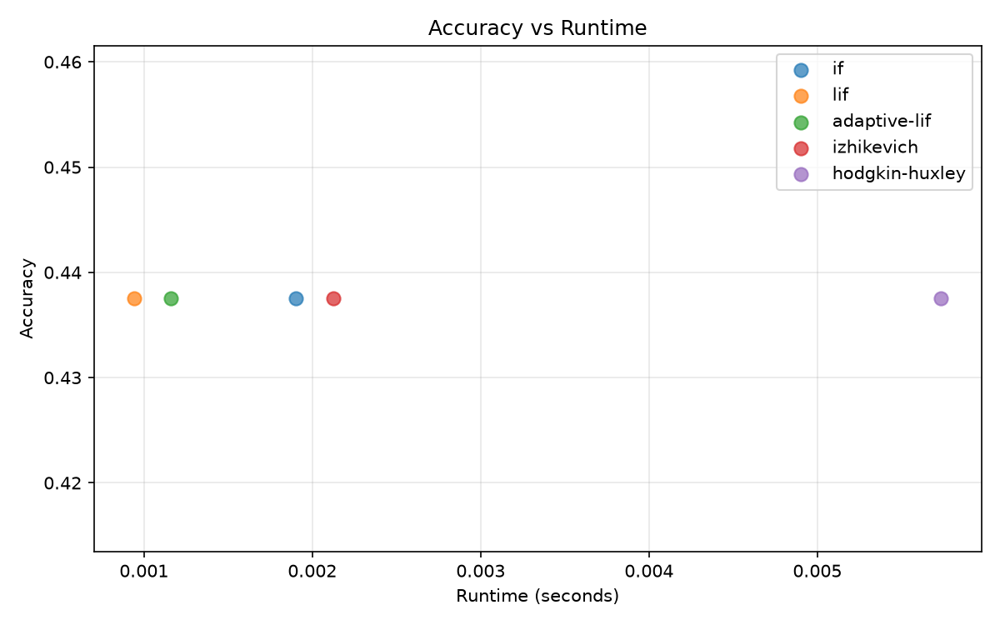
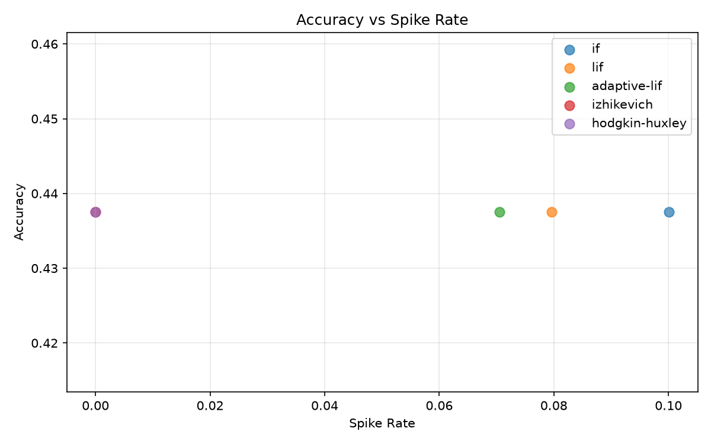

# Benchmark Results Summary

## Accuracy vs Runtime

## Accuracy vs Spike Rate

## Results Table

| neuron         |   samples |   steps |   accuracy |   runtime_seconds |   spike_rate |
|:---------------|----------:|--------:|-----------:|------------------:|-------------:|
| if             |        32 |       8 |     0.4375 |         0.0019026 |    0.100098  |
| lif            |        32 |       8 |     0.4375 |         0.0009426 |    0.0795898 |
| adaptive-lif   |        32 |       8 |     0.4375 |         0.0011616 |    0.0705566 |
| izhikevich     |        32 |       8 |     0.4375 |         0.0021247 |    0         |
| hodgkin-huxley |        32 |       8 |     0.4375 |         0.0057339 |    0         |
